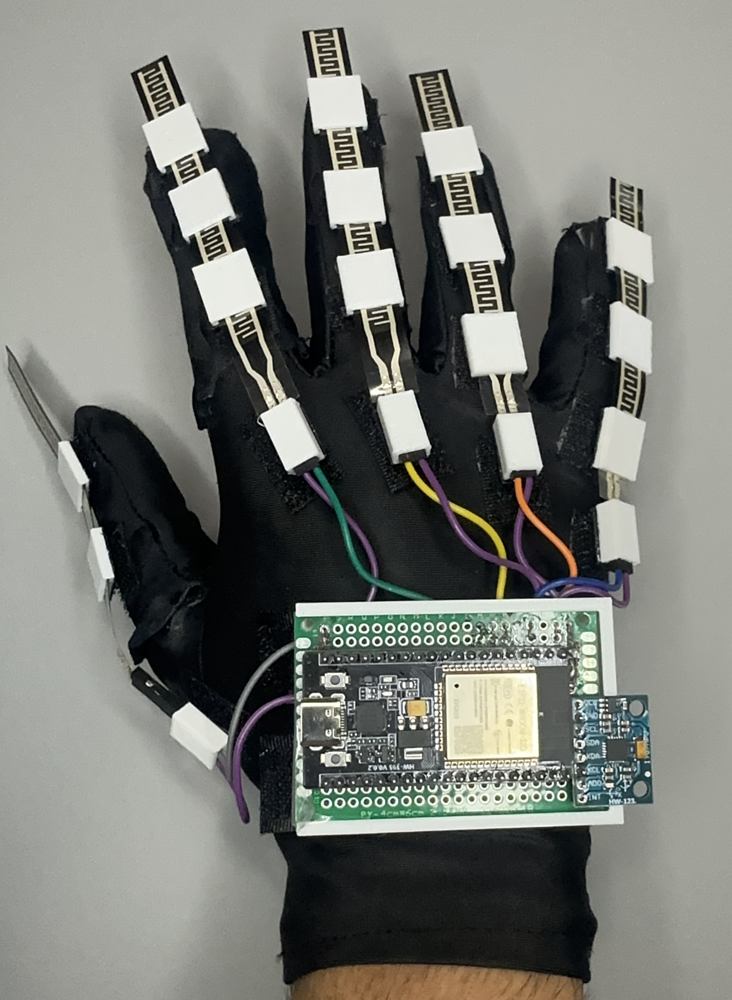
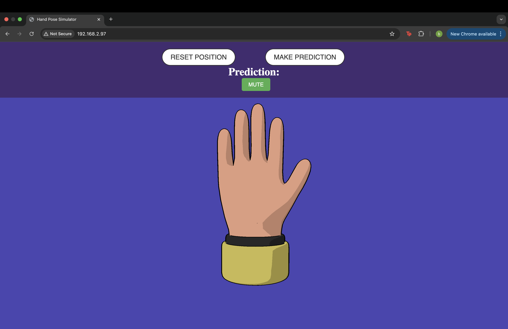
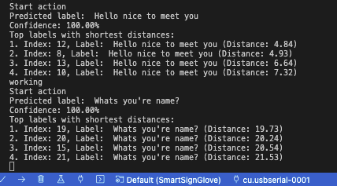
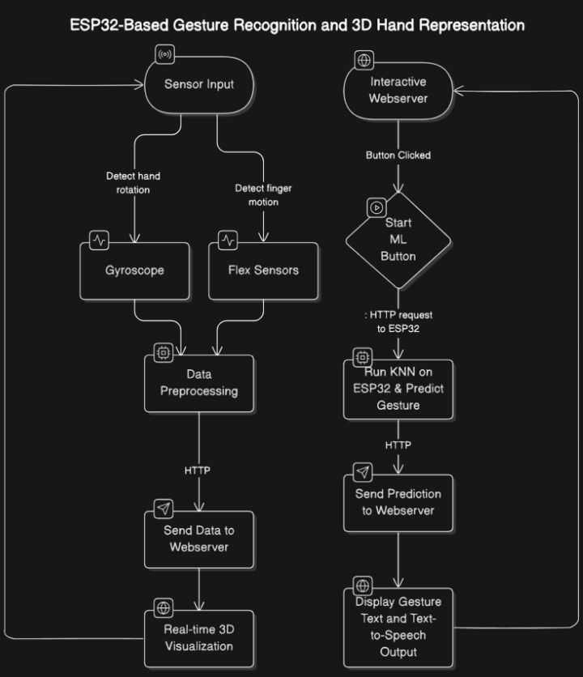
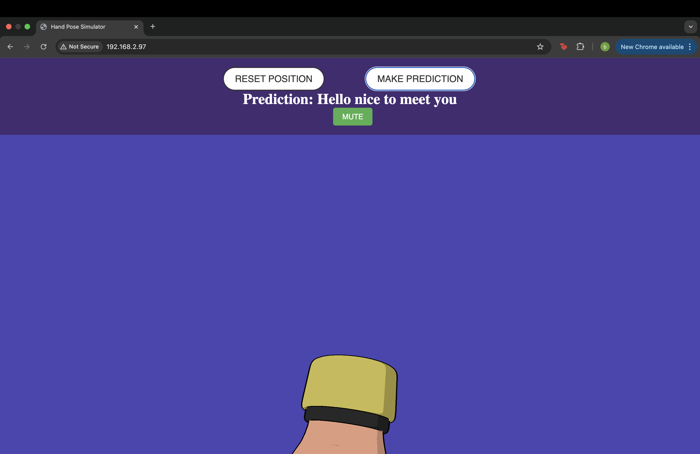
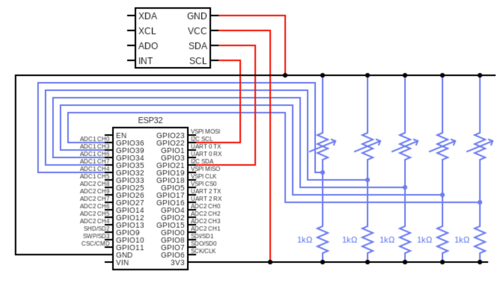
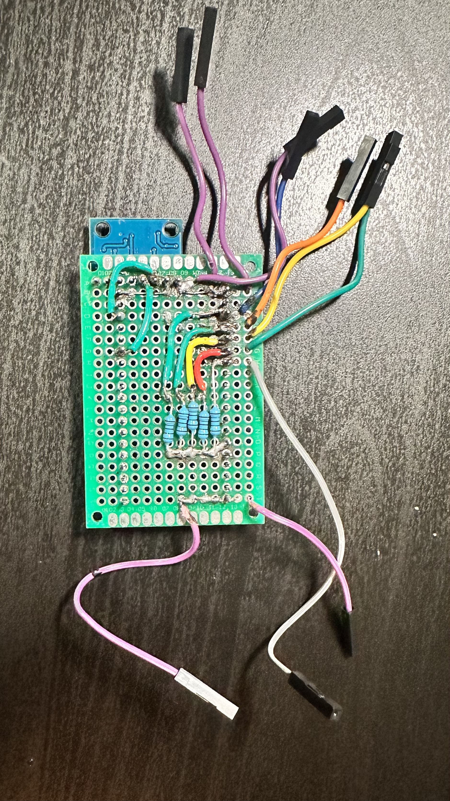

<div align="center">
  <h1>Smart Sign Language Glove Translator</h1>
  
  
    https://www.youtube.com/watch?v=jdae4z19YxA
</div>

The Smart Sign Language Glove is an innovative wearable device designed to bridge the communication gap for individuals who use sign language by translating gestures into spoken or text-based output. At its core, the ESP32 microcontroller acts as the central processing unit, facilitating real-time data acquisition from flex sensors and gyroscope/accelerometer modules. These inputs are analyzed and processed to accurately interpret sign language gestures and deliver the corresponding spoken or textual translation.
This project was completed within a month, combining foundational principles with newly acquired skills. The key technical components include the implementation of machine learning algorithms (K-Nearest Neighbors), asynchronous HTTP communication protocols, optimized data structures, 3D modeling with AutoCAD, advanced data acquisition techniques, and embedded systems development.


## Table of Contents 

- [KNN Model](#KNN-Model)
- [Webserver](#Webserver)
- [Hardware](#Hardware)
- [3D Hand Model](#3D_Hand_Model)
- [Future Improvements](#Future_Improvements)
- [References](#References)


## KNN-Model
The sensor data is stored in queues over a period of 3 seconds to capture the full range of motion for a phrase. Before running the KNN prediction model, the sensor readings are normalized to ensure consistency across variations in the user’s hand size, movements, and sensor value ranges. This normalization step ensures the system’s robustness and reliability. The processed data is then fed into a K-Nearest Neighbors (KNN) machine learning model for gesture classification.
The KNN algorithm operates by comparing the feature vector of the current gesture to the stored training data, calculating the Euclidean distance between the new data point and all points in the training set. It then identifies the k nearest neighbors and assigns the gesture the most frequently occurring label among them. To ensure prediction accuracy, a confidence score is computed, and only predictions with a confidence score of 80% or higher are considered valid. The system supports both training and prediction modes and transmits recognized gestures to a connected web server via an API. This enables dynamic visualization, translation, or seamless integration with other applications, making it a practical and efficient real-time translation tool that bridges communication gaps for sign language users.

<div align="center">
   
   
</div>


## Webserver

The web server for this project integrates two key components. The client-side code, written in JavaScript, runs in the browser to handle the 3D hand model. The server-side code on the ESP32 manages communication with the client. This setup allows for real-time interaction, where physical hand gestures are accurately represented through a dynamic 3D model rendered in the browser.
### Web Client (JavaScript):
Three.js Setup: The code uses the Three.js library for 3D rendering, loading a GLTF model of a hand (hand.glb) and adjusting its properties, such as scale and material. It also handles lighting, texture loading, and animation of the hand's skeleton (bones).
<div align="center">
   
</div>


### EventSource: 
EventSource is used for server-to-client communication, enabling the client to listen for server-sent events (SSE). When the ESP32 sends real-time data, such as sensor values (e.g., flex_sensor or prediction), the client listens for these updates and applies them to the 3D model. This process can involve modifying the position or rotation of the hand model's bones (such as the thumb or index finger) in real-time. SSE provides a simple, one-way communication from the server to the client, ideal for receiving continuous updates without needing to poll the server repeatedly

### XMLHttpRequest: 
XMLHttpRequest is used for client-to-server communication. When the client needs to initiate an action or request data from the server, it sends an HTTP request (e.g., a GET request). For instance, if the client needs to reset the position of the hand model or make a prediction, the function would send a request to the server to update and/or fetch necessary data. 

### Speech Output: 
It also includes a speakText function that uses the Web Speech API to convert the received predictions (e.g., hand gesture identification) into speech. This can be muted for convenience 

### ESP32 Server Code:
Sensor Data Collection: The esp32 read data from the flex sensors and MPU6050 to detect hand movements. This data is then processed and sent to the web client via a json string.

### Web Server: 
The ESP32 functions as a web server, serving both static files (e.g., hand.glb, textures, JavaScript) and dynamic data (e.g., flex sensor readings, hand pose predictions) via HTTP.
#### Sample code
```
            server.on("/", HTTP_GET, [](AsyncWebServerRequest *request)
                        { request->send(LittleFS, "/index.html", "text/html"); });
```

This setup allows for real-time interaction with 3D models on the web, where the ESP32 serves as both the sensor data provider and web server. The dynamic updating of the 3D scene in the browser creates an interactive experience where physical actions (such as hand gestures) can be visually represented in real-time while predicting gestures using ML algorithms.


## Hardware
<div align="center">
  
</div>

The general schematic can be seen above to recreate the system (ESP32, 5 variable resistors/flex sensors, MPU6050, 5 1kΩ Resistors). We decided to solder our components directly on a PCB board (4cm x 6cm) for simplicity and ease of use; however, you may use a breadboard. You may also notice we used 3D-printed parts alongside velcro to attach the components to the glove. Depending on your preferences and available resources, this design can be realized using custom 3D-printed parts or alternative mounting solutions.

<div align="center">
  
</div>


## 3D_Hand_Model
The 3D hand model is loaded in the browser using the GLTFLoader from Three.js, enabling realistic visualization of hand gestures. The model’s properties, such as materials, lighting, and textures, are customized using tools like MeshToonMaterial to enhance its appearance. The hand’s scale and orientation are adjusted to align with real-world movements.
Real-time sensor data from the ESP32, including finger flexion values and hand orientation readings, are sent to the browser and used to animate the model. These values are mapped to the bones of the 3D hand, allowing the model to mimic physical gestures in real-time. Smooth animations are achieved using GSAP, which ensures that transitions between hand positions are fluid and visually appealing. This integration creates an interactive experience where physical actions are immediately mirrored by the 3D model, making it an effective tool for gesture visualization and interaction.

<div align="center">
  
</div>


## Future_Improvements
To enhance the system’s functionality and performance, several improvements are planned. First, machine learning algorithms like neural networks will be implemented to improve the accuracy of gesture predictions. These models will be evaluated using metrics such as accuracy and F1-score, enabling a thorough comparison with the existing approach.
Additionally, a second hand model powered by an external power supply is being developed. This enhancement will allow the device to operate independently of a physical connection after the firmware and filesystem are flashed. Together, these advancements aim to make the system more robust, accurate, and versatile for real-world applications.

## References
3-D model on web server: <br>
https://threejs.org/ <br>
https://github.com/Kirilbt/hand-armature?tab=readme-ov-file 

ESP32 pinout and functionality: <br>
https://docs.sunfounder.com/projects/esp32-starter-kit/en/latest/components/component_esp32_extension.html <br>
https://randomnerdtutorials.com/getting-started-with-esp32/

PlatformIO: <br>
https://docs.platformio.org/en/latest/projectconf/index.html <br>
https://docs.platformio.org/en/latest/integration/ide/pioide.html

# speech

